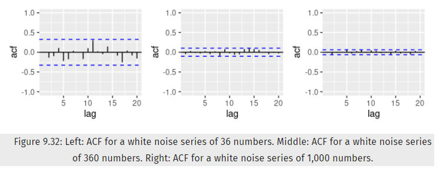

```{r setup, include=FALSE}
knitr::opts_chunk$set(echo = TRUE, message = FALSE, warning = FALSE, cache=FALSE,
                      out.width = "100%")

library("fpp3")
library("plotly")
library("kableExtra")
library("forecast")

##making theme
mpeach <- "#fbaa82"
mteal <- "#73a2ac"
mdarkteal <- "#0b5d69"
mgray <- "#4c4c4c"

# set plot theme for assignment
my_plot_theme <- list(
  theme_classic() +
  theme(plot.background = element_rect(fill = "#F3F2E8"),
        panel.background = element_rect(fill = "#F3F2E8"),
        panel.grid.major.x = element_line(color = "white"),
        axis.title.y = element_text(face = "bold"),
        axis.title.x = element_text(face = "bold"),
        text = element_text(size = 20)))
```


**Exercises from Section 9 of Forecasting: Principles & Practice at https://otexts.com/fpp3/arima-exercises.html**


# Exercise 9.1

#### Figure 9.32 shows the ACFs for 36 random numbers, 360 random numbers and 1,000 random numbers.

#### (a) Explain the differences among these figures. Do they all indicate that the data are white noise?  

Technically yes, since all nearly 95% of the points on each plot are within the blue dotted lines we'd conclude the data to be white noise as they are all close to zero with some random variation. 




#### (b) Why are the critical values at different distances from the mean of zero? Why are the autocorrelations different in each figure when they each refer to white noise?

This is due to the changes in the size of the data. As more data is randomly generated the distribution will become more normally distributed. In smaller data sets it's easier for a value to seem extreme.


# Exercise 9.3

#### For the following series, find an appropriate Box-Cox transformation and order of differencing in order to obtain stationary data.

#### (a) Turkish GDP from global_economy.  

First I plot the data as-is. The data doesn't appear to have any seasonality, but does begin with very little increase, then much greater increases as time goes on. The ACF plot suggests non-stationarity with a R1 value close to 1.0 and many values outside the blue-dotted line range. A Box-Cox may be useful since the values and variance are so low until about 1990 in tsi dataset.
```{r}
turkey_gdp <- global_economy %>%
    filter(Country == 'Turkey')

gg_tsdisplay(turkey_gdp, GDP)
```

I check the lambda value for this dataset and it appears to be 0.157 so a log transformation will be applied. The plot appears more linear, but we still have non-stationarity to deal with.

```{r}
#strip df down
turkey_gdp_prepped <- dplyr::select(turkey_gdp, GDP)

#determine lambda
BoxCox.lambda(turkey_gdp_prepped$GDP)

#perform boxcox and apply to df
turkey_gdp_prepped$GDP <- box_cox(turkey_gdp_prepped$GDP, BoxCox.lambda(turkey_gdp_prepped$GDP))

#plot transformed data
turkey_gdp_prepped %>% gg_tsdisplay(GDP, plot_type = 'partial')


```


Next we use the KPSS test to test if the data is stationary. With a p-value of 0.01 means the value is lower than this, which indicated the null hypothesis is rejected and the data are not stationary.

```{r}
turkey_gdp_prepped %>%
  features(GDP, unitroot_kpss)
```

When using the ndiffs (or unitroot_ndiffs) function we see that the right number of differences is one. 

```{r}
ndiffs(turkey_gdp_prepped$GDP)
```

Looking at the plot Box-Cox transformed (log) and then taking the first order differencing, we see stationary data at last.

```{r}
ggtsdisplay(diff(turkey_gdp_prepped$GDP))
```


#### (b) Accommodation takings in the state of Tasmania from aus_accommodation. 

Below we definitely see seasonality across the quarters, so a lag of 4, as well as increasing variance across the seasons. 

```{r}
# create df
tasmania_takings <- aus_accommodation %>%
    filter(State == 'Tasmania')

#display data
gg_tsdisplay(tasmania_takings, Takings)

```

First we preform a Box-Cox transformation.With a lambda of -.0.005 a log transformation is performed which does correct some of the variance.

```{r}
#strip df down
tasmania_takings_prepped <- dplyr::select(tasmania_takings, Takings)

#determine lambda
BoxCox.lambda(tasmania_takings_prepped$Takings)

#perform boxcox and apply to df
tasmania_takings_prepped$Takings <- box_cox(tasmania_takings_prepped$Takings, BoxCox.lambda(tasmania_takings_prepped$Takings))

#plot transformed data
tasmania_takings_prepped %>% gg_tsdisplay(Takings, plot_type = 'partial')
```
To deal with the seasonality we won't even do a KPSS test to start as it's very obvious the data isn't stationary. The ndiffs() function suggests one differencing is best.


```{r}
ndiffs(tasmania_takings_prepped$Takings)

```

The display below shows the Box-Cox (log) transformed data with one difference taken. 

```{r}
ggtsdisplay(diff(tasmania_takings_prepped$Takings))

```
While I see the seasonality in the data still that is affecting the ACF plot, I'll use the KPSS test to see if the data is now considered stationary. With a p-value of 0.1 the null hypotehsis is accepted - the data are stationary.

```{r}
unitroot_kpss((diff(tasmania_takings_prepped$Takings)))
```


#### (c) Monthly sales from souvenirs.

The plot shows annual spikes in December, with increasing variance as time goes on.

```{r}

#display data
gg_tsdisplay(souvenirs, Sales)
```


With a lambda of -0.24 this is slightly closer to 0 than -0.5 so a log transformation is performed. We see the data variance has decreased in the scatterplot.

```{r}
souvenirs_prepped <- souvenirs

#determine lambda
BoxCox.lambda(souvenirs_prepped$Sales)

#perform boxcox and apply to df
souvenirs_prepped$Sales <- box_cox(souvenirs_prepped$Sales, BoxCox.lambda(souvenirs_prepped$Sales))

#plot transformed data
souvenirs_prepped %>% gg_tsdisplay(Sales, plot_type = 'partial')
```
Again, we'll skip the KPSS as it's obvious the data needs some differencing. An order of one difference is suggested again.

```{r}
ndiffs(souvenirs_prepped$Sales)
```

Finally below we see the data, while still displaying seasonality, that has been Box-Cox transformed and differenced once.

```{r}
ggtsdisplay(diff(souvenirs_prepped$Sales))

```

A final check of the KPSS test confirm the data is stationary now.

```{r}
unitroot_kpss((diff(souvenirs_prepped$Sales)))

```


# Exercise 9.5

#### For your retail data (from Exercise 8 in Section 2.10), find the appropriate order of differencing (after transformation if necessary) to obtain stationary data.

Reproducing the same sample of data for 'myseries' and plotting, below I see the data is certainly not stationary and possibly has some seasonality, as well as increasing variance.

```{r}
set.seed(8675309)
myseries <- aus_retail %>%
  filter(`Series ID` == sample(aus_retail$`Series ID`,1))

gg_tsdisplay(myseries, Turnover)
```

Below I check perform the Box-Cox and see a lambda of 0.038 - so a log transformation will likely be performed.

```{r}
#strip df down
myseries_prepped <- dplyr::select(myseries, Turnover)

#determine lambda
BoxCox.lambda(myseries_prepped$Turnover)
```

I see the transformation has made the data more linear and smoothed out some of the variance across time.

```{r}
#perform boxcox and apply to df
myseries_prepped$Turnover <- box_cox(myseries_prepped$Turnover, BoxCox.lambda(myseries_prepped$Turnover))

#plot transformed data
myseries_prepped %>%
  gg_tsdisplay(Turnover, plot_type = "partial")
```

Next I check if any differencing is needed, and just one is suggested.

```{r}
ndiffs(myseries_prepped$Turnover)
```


Below we see the transformed data with one difference taken. Outside of the seasonality, the data appear to be stationary now. 
```{r}
ggtsdisplay(diff(myseries_prepped$Turnover))
```

A quick check with the KPSS test confirms the data is stationary.

```{r}
unitroot_kpss(diff(myseries_prepped$Turnover))
```


# Exercise 9.6

#### Simulate and plot some data from simple ARIMA models.

#### (a) Use the following R code to generate data from an AR(1) model with ϕ1=0.6 and σ2=1 . The process starts with y1=0.

```{r}
y <- numeric(100)
e <- rnorm(100)
for(i in 2:100)
  y[i] <- 0.6*y[i-1] + e[i]
sim_0.6 <- tsibble(idx = seq_len(100), y = y, index = idx)


```


#### (b) Produce a time plot for the series. How does the plot change as you change ϕ1? 

```{r}
sim_0.6 %>%
  autoplot(y)
```

```{r}

for(i in 2:100)
  y[i] <- 0.05*y[i-1] + e[i]
sim_0.05 <- tsibble(idx = seq_len(100), y = y, index = idx)


sim_0.05 %>%
  autoplot(y)
```

```{r}

for(i in 2:100)
  y[i] <- 0.95*y[i-1] + e[i]
sim_0.95 <- tsibble(idx = seq_len(100), y = y, index = idx)


sim_0.95 %>%
  autoplot(y)
```

From looking at the plots above it appears that lower values of phi appear to have more noise, and with higher values of phi the trend and possibly cycles are more evident.


#### (c) Write your own code to generate data from an MA(1) model with θ1=0.6 and σ2=1.

```{r}
for(i in 2:100)
  y[i] <- 0.6*e[i-1] + e[i] #1st order moving average model 

sim_ma1_0.6 <- tsibble(idx = seq_len(100), y = y, index = idx)

```


#### (d) Produce a time plot for the series. How does the plot change as you change θ1?

```{r}
sim_ma1_0.6 %>%
  autoplot(y)
```

```{r}
for(i in 2:100)
  y[i] <- 0.01*e[i-1] + e[i] #1st order moving average model 

sim_ma1_0.01 <- tsibble(idx = seq_len(100), y = y, index = idx)


sim_ma1_0.01 %>%
  autoplot(y)
```

From the plots above it appears that a smaller value results in more variance and magnitude of the data.


#### (e) Generate data from an ARMA(1,1) model with ϕ1=0.6, θ1=0.6 and σ2=1.

```{r}
for(i in 2:100)
  y[i] <- 0.6*y[i-1] + 0.6*e[i-1] + e[i]

arma_1 <- tsibble(idx = seq_len(100), y = y, index = idx)

```


#### (f) Generate data from an AR(2) model with ϕ1=−0.8, ϕ2=0.3 and σ2=1. (Note that these parameters will give a non-stationary series.)


```{r}
for(i in 3:100)
  y[i] <- -0.8*y[i-1] + 0.3*y[i-2] + e[i] 

arma_2 <- tsibble(idx = seq_len(100), y = y, index = idx)
```


#### (g) Graph the latter two series and compare them.

```{r}
arma_1 %>%
  autoplot(y)
```

```{r}
arma_2 %>%
  autoplot(y)
```

The first plot doesn't appear to have any seasonality, but there are cycles present. To the eye I don't see a trend. The second plot has very clear patterns, with increasing variance around the same mean. Seasonality is present.


# Exercise 9.7


#### Consider aus_airpassengers, the total number of passengers (in millions) from Australian air carriers for the period 1970-2011.

#### (a) Use ARIMA() to find an appropriate ARIMA model. What model was selected. Check that the residuals look like white noise. Plot forecasts for the next 10 periods.  

First I build the model and take a look at the report results. An ARIMA(0,2,1) was selected.

```{r}

fit_1 <- aus_airpassengers %>%
  model(ARIMA(Passengers))


report(fit_1)

```

In looking at the residuals we see a fairly normal histogram and the ACF plot has values within the bounds, suggesting the residuals are only white noise.


```{r}
fit_1 %>%
  gg_tsresiduals()
```

Forecasting 10 years of data is displayed with confidence levels below. The upward trend continues, with decreasing confidence of the predicted values, as expected.

```{r}
fit_1 %>%
  forecast(h = 10) %>%
  autoplot(aus_airpassengers)
```


#### (b) Write the model in terms of the backshift operator.

Unfortunately I didn't understand this very short section of the chapter and am not sure the use/application of a backshift operation notation.


#### (c) Plot forecasts from an ARIMA(0,1,0) model with drift and compare these to part a.

This model with the drift appears to have more conservative forecasts, still an upward trend but not as rapid.

```{r}
#model ARIMA with forced 0,1,0
fit_2 <- aus_airpassengers %>%
  model(ARIMA(Passengers ~ pdq(0,1,0)))

fit_2 %>%
  forecast(h = 10) %>%
  autoplot(aus_airpassengers)
```


#### (d) Plot forecasts from an ARIMA(2,1,2) model with drift and compare these to parts a and c. Remove the constant and see what happens.

This model doesn't appear to generate any forecast at all with the package I was using, so I switched packages so I can use the include.drift parameter. After exploring further, removing the constant prevent it from building a model, so the constant is necessary - possibly for stationarity?

```{r}
# force ARIMA to 2,1,2 - switching to other package as I don't know how to add drift
fit_3 <- Arima(aus_airpassengers$Passengers, 
               order = c(2,1,2), include.drift = TRUE) 

fit_3 %>% 
  forecast(h = 10) %>%
  autoplot()


```


#### (e) Plot forecasts from an ARIMA(0,2,1) model with a constant. What happens?

This is the same model/plot as done in part A, except we've forced the model this time.

```{r}
#model ARIMA with forced 0,1,0
fit_4 <- aus_airpassengers %>%
  model(ARIMA(Passengers ~ pdq(0,2,1)))

fit_4 %>%
  forecast(h = 10) %>%
  autoplot(aus_airpassengers)
```


# Exercise 9.8

#### For the United States GDP series (from global_economy):

I created the subset dataframe and plot. It appears to be a fairly smooth upward trend with no seasonality or cycles.

```{r}
usa_gdp <- global_economy %>%
  filter(Country == "United States") %>%
  dplyr::select(GDP)

usa_gdp %>%
  autoplot(GDP)

```


#### (a) if necessary, find a suitable Box-Cox transformation for the data;  

With a lambda of 0.28 we will perform a Box-Cox transformation.

```{r}
#determine lambda
BoxCox.lambda(usa_gdp$GDP)
```

Despite the data being quite smooth to begin with, the transformation makes it even smoother - this might not be necessary but likely will help the model.

```{r}
#perform boxcox and apply to df
usa_gdp$GDP <- box_cox(usa_gdp$GDP, BoxCox.lambda(usa_gdp$GDP))

#plot transformed data
usa_gdp %>% 
  gg_tsdisplay(GDP, plot_type = 'partial')
```


#### (b) fit a suitable ARIMA model to the transformed data using ARIMA();  

We see a constant is included and it chose a (1,1,0) model.

```{r}
fit <- usa_gdp %>%
  model(ARIMA(GDP))

report(fit)
```


#### (c) try some other plausible models by experimenting with the orders chosen;

We haven't checked if there are any necessary differencing yet, so I'll start there. It appears one is necessary on the Box-Cox transformed data.

```{r}
ndiffs(usa_gdp$GDP)
```

All but one value is within the ACF plot bounds. A check with the KPSS test confirms the data is stationary after one order of differencing.

```{r}
ggtsdisplay(diff(usa_gdp$GDP))

unitroot_kpss((diff(usa_gdp$GDP)))

usa_gdp_1diff <- usa_gdp %>%
  mutate(GDP_diff = difference(GDP))

```

It appears this  model is still selected despite the differencing. 

```{r}
fit2 <- usa_gdp_1diff %>%
  model(ARIMA(GDP))

report(fit2)
```


I'll try another ARIMA model to see how it performs. This one appears to perform worse than the selected model above by automation. I'd imagine with more experience and background there may be times a datascience would be able to achieve a better model than the automation picks.

```{r}
#model ARIMA with forced 0,1,0
fit_force <- usa_gdp_1diff %>%
  model(ARIMA(GDP ~ pdq(1,1,2)))

report(fit_force)

```


#### (d) choose what you think is the best model and check the residual diagnostics;

I'll choose the original model and check how it performs. The historgram is a bit skewed, however the ACF plot looks good such that the residuals are white noise.

```{r}
gg_tsresiduals(fit)
```


#### (e) produce forecasts of your fitted model. Do the forecasts look reasonable?

A visual inspection fo the forecast looked quite reasonable, the trend continues.

```{r}
fit %>%
  forecast(h = 10) %>%
  autoplot(usa_gdp)
```


#### (f) compare the results with what you would obtain using ETS() (with no transformation).  

Switching back to the forecast package I build an ETS model to check it's performance against our more complex ARIMA model. The AIC here is significantly higher, suggesting the ARIMA is performing better. This is a nice benchmark to see our more advanced model is worth the effort.

```{r}
ets_check <- usa_gdp$GDP %>%
  ets()

ets_check
```


