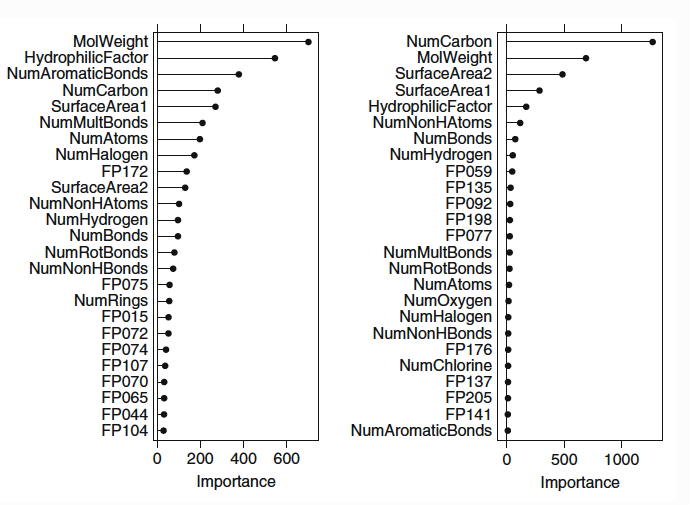

```{r setup, include=FALSE}
knitr::opts_chunk$set(echo = TRUE, message = FALSE, warning = FALSE, cache=FALSE,
                      out.width = "100%")

library("mlbench") #for datasetes used below
library("skimr") #for data exploration
library("tidyverse")
library("caret")
library("elasticnet")
library("RANN")
library("AppliedPredictiveModeling")
library("corrplot") #for correlation plot
library("mlbench")
library("kernlab")
library("earth")
library("partykit")
library("randomForest")
library("gbm")
library("Cubist")
library("rpart")

```


**Exercises from Chapter 7 of textbook Applied Predictive Modeling by Kuhn & Johnson**


# 8.

#### Recreate the simulated data from Exercise 7.2:

```{r}
set.seed(200)
simulated <- mlbench.friedman1(200, sd = 1)
simulated <- cbind(simulated$x, simulated$y)
simulated <- as.data.frame(simulated)
colnames(simulated)[ncol(simulated)] <- "y"
```


#### (a) Fit a random forest model to all of the predictors, then estimate the variable importance scores. Did the random forest model significantly use the uninformative predictors (V6 – V10)?  

From the output below it appears V6-V10 had minimal important in the model.
```{r}

model1 <- randomForest(y ~ ., data = simulated,
                      importance = TRUE,
                      ntree = 1000)
rfImp1 <- varImp(model1, scale = FALSE)

rfImp1
```


#### (b1) Now add an additional predictor that is highly correlated with one of the informative predictors. For example:
```{r}
simulated$duplicate1 <- simulated$V1 + rnorm(200) * .1
cor(simulated$duplicate1, simulated$V1)
```

  
#### (b2) Fit another random forest model to these data. Did the importance score for V1 change?  

Yes, the importance of V1 decreased in this second model, though not quite proportional the the amount V11 (the duplicate) created.
```{r}
model2 <- randomForest(y ~ ., data = simulated,
                      importance = TRUE,
                      ntree = 1000)
rfImp1 <- varImp(model2, scale = FALSE)

rfImp1
```
#### (b3) What happens when you add another predictor that is also highly correlated with V1?  

V1 drops again, but not by as much this time.
```{r}
simulated$duplicate2 <- simulated$V1 + rnorm(200) * .1
cor(simulated$duplicate2, simulated$V1)

model3 <- randomForest(y ~ ., data = simulated,
                      importance = TRUE,
                      ntree = 1000)
rfImp1 <- varImp(model3, scale = FALSE)

rfImp1

```

#### (c) Use the `cforest` function in the `party` package to fit a random forest model using conditional inference trees. The party package function `varimp` can calculate predictor importance. The `conditional` argument of that function toggles between the traditional importance measure and the modified version described in Strobl et al. (2007). Do these importances show the same pattern as the traditional random forest model? 

They do appear to have the same pattern, with variables V6-V10 not ranking high.

```{r}
model4 <- cforest(y ~ ., data = simulated)
varimp(model4)
```


#### (d) Repeat this process with different tree models, such as boosted trees and Cubist. Does the same pattern occur?

```{r}
boost_model <- gbm(y ~., data = simulated, distribution = "gaussian")
summary.gbm(boost_model)
```

```{r}
cub_sim <- cubist(simulated[,-11], simulated$y)
cub_sim$usage
```


The additionally models above also successfully avoided incorrectly using the unimportant variables to a high degree.


# 8.2 

#### Use a simulation to show tree bias with different granularities.

Below we see that more importance is placed on x over x2 simply because that variable has less variance.
```{r}
x <- rep(1:2, each=100) 
x2 <- rnorm(200, mean=0, sd=4)
y <- x + rnorm(200, mean= 0 , sd=1)
data <- data.frame(y,x,x2)

tree_simulation <- rpart(y~., data=data)
varImp(tree_simulation)

```
# 8.3

#### In stochastic gradient boosting the bagging fraction and learning rate will govern the construction of the trees as they are guided by the gradient. Although the optimal values of these parameters should be obtained through the tuning process, it is helpful to understand how the magnitudes of these parameters affect magnitudes of variable importance. Figure 8.24 provides the variable importance plots for boosting using two extreme values for the bagging fraction (0.1 and 0.9) and the learning rate (0.1 and 0.9) for the solubility data.  The left-hand plot has both parameters set to 0.1, and the right-hand plot has both set to 0.9:



#### (a) Why does the model on the right focus its importance on just the first few predictors, whereas the model on the left spreads importance across more predictors?

I believe it's accurate to say that the right-hand plot is essentially more stringent, due to the tuning parameters, in it's threshhold for considering a predictor as important - it's considered a greedy or a rapid leaner. Alternatively, the left-hand plot could be characterizes as more methodical, it doesn't need to learn fast so it spends more time finding relationships in the data.


#### (b) Which model do you think would be more predictive of other samples?

While these are both extreme settings, I think the left-hand model would be better at predicting new data, as it's incorporated more diverse data which should limit the overfitting issues the model on the right likely would have.


#### (c) How would increasing interaction depth affect the slope of predictor importance for either model in Fig. 8.24?

As the interaction depth is increased, we would see more predictors with importance, and more predictors with greater importance. As the maximum number of nodes per tree increases, it leaves more room to assign importance.

# 8.7 

#### Refer to Exercises 6.3 and 7.5 which describe a chemical manufacturing process. Use the same data imputation, data splitting, and pre-processing steps as before and train several tree-based models:

First I copy in the code from my previous work.

```{r}
data(ChemicalManufacturingProcess)
chem <- as.data.frame(ChemicalManufacturingProcess)

knn_imp <- preProcess(chem, "knnImpute")
chem_imp <- predict(knn_imp, chem)

#split train/test
set.seed(3190)
sample_set <- sample(nrow(chem_imp), round(nrow(chem_imp)*0.75), replace = FALSE)

chem_train <-chem_imp[sample_set, ]
chem_train_x <- chem_train[, -1]
chem_train_y <- chem_train[, 1]


chem_test <-chem_imp[-sample_set, ]
chem_test_x <- chem_test[, -1]
chem_test_y <- chem_test[, 1]


```


#### (a) Which tree-based regression model gives the optimal resampling and test set performance?

**Random Forest**  

This model doesn't look spectacular, it explain 57% of the variance in the data with a somewhat high RMSE of 0.684.

```{r}
randf_model <- randomForest(chem_train_x, chem_train_y, importance = TRUE, ntrees = 1000)
randf_model

randf_pred <- predict(randf_model, newdata = chem_test_x)
postResample(pred = randf_pred, obs = chem_test_y)
```

**Boosted**  

This boosted model appear to be worse than the random forest above, it has a lower R-squared and even higher RMSE/MAE.

```{r}
boosted_model <- gbm.fit(chem_train_x, chem_train_y, distribution = "gaussian") 
boosted_model

boosted_pred <- predict(boosted_model, newdata = chem_test_x)
postResample(pred = boosted_pred, obs = chem_test_y)
```


**Cubist**

The cubist model is comparable to the first model, the Random Forest - however the Random Forest does technically outperform the cubist. Further tuning may find slight advantages, but at it's base/default level it performs best on this data.

```{r}
cub_model <- cubist(chem_train_x, chem_train_y)
cub_model

cub_pred <- predict(cub_model, newdata = chem_test_x)
postResample(pred = cub_pred, obs = chem_test_y)
```


#### (b) - Which predictors are most important in the optimal tree-based regression model? - Do either the biological or process variables dominate the list? - How do the top 10 important predictors compare to the top 10 predictors from the optimal linear and nonlinear models?

For the Random Forest Model we see the top 10 important variables below. Again we see over half are manufacturing measures, although there is one more biological measure in this model compared to my last two, and they appear a bit higher in the list. 

```{r}
randf_imp <- varImp(randf_model)


head(rownames(randf_imp)[order(randf_imp$Overall, decreasing=TRUE)], 10)
```


#### (c) Plot the optimal single tree with the distribution of yield in the terminal nodes. Does this view of the data provide additional knowledge about the biological or process predictors and their relationship with yield? 

With this visualization I see that the biological predictors only are useful when the first node, `ManufacturingProcess32`, is less than 0.192. This is where we see the 4 biological predictors come into play. 

```{r}
rpart_tree <- rpart(Yield ~., data = chem_train)

tree_plot <- as.party(rpart_tree)
plot(tree_plot)


```


Further, a quick look at how `ManufacturingProcess32` is distributed shows that the nodes split point of 0.192 is fairly close to half of the data - meaning for half of the data no biological predictors are even used.

```{r}
summary(chem_train$ManufacturingProcess32)

boxplot(chem_train$ManufacturingProcess32)

```


